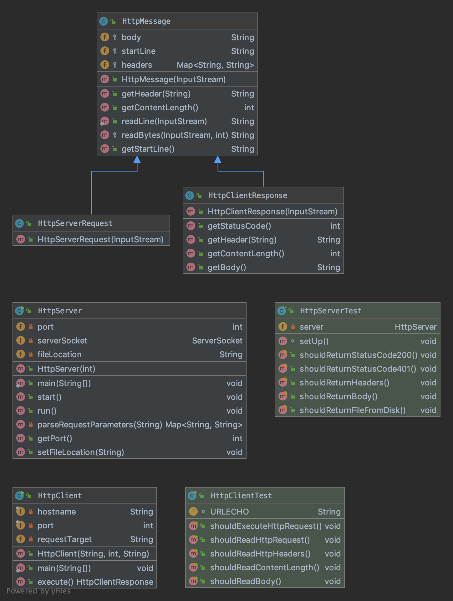

# Data Access Object innlevering

[![Build Status] https://travis-ci.com/Westerdals/pgr203-assignment-3-Eskildt/builds/132713195]

<Ved å bruke dette prosjektet kan man opprette nye brukere med navn, prosjekt og epost.
I tillegg lister programmet ut de som er lagt inn i tabellen.>

## Usage

1. <Maven -> Package>
2. <Kopier jar fil til terminal og kjør: java -jar <path to jar-file>>
3. <Etter den er kjørt skriver man member eller project avhengig av hva man skal opprette>
4. <Følger deretter anvisningene som kommer i terminal>
5. <Bruker nettleseren(gjerne google chrome) til å søke opp http://localhost:8080/>  

 ## Design (valgfritt)
 

 ## Implementation notes
 
<Prosessen ble intuitiv og strømlinjeformet for brukeren når de først har kjørt Jar filen>

<Oversiktlig tabellformat>

## Link to review

* link to issue you registered in other group's github repository
